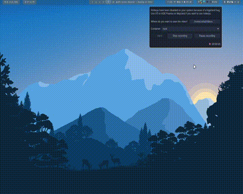
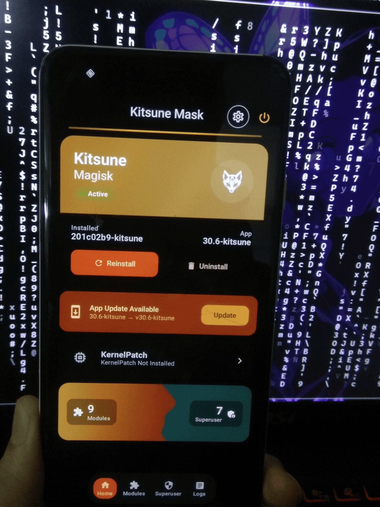
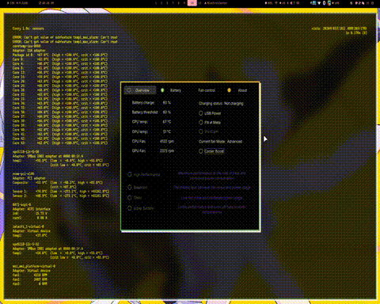

# Vedant P. Dubal

**DevOps · SRE · System Administrator**

> Hey, I'm Vedant — first-year B.Tech student.
> I spend my time breaking Linux installations, fixing them, and calling it learning. ¯\_(ツ)_/¯

I work on the layer between code and the metal it runs on — infrastructure automation, container orchestration, system reliability, and occasionally training AI models at 2 AM while laptop fans scream at 8000 RPM.

Not a tutorial follower. I pick something, break it badly enough that I *have* to understand it to fix it, then write about what actually happened — not the clean version.

---

## What I Actually Work On

```
infrastructure automation  →  containers & orchestration  →  keep systems alive
```

```bash
$ whoami
devops-in-progress | sysadmin | homelab guy | occasionally breaks things on purpose

$ uptime
00:00:00
```

---

## Skills

#### Infrastructure & DevOps


 <!--   -->

#### Monitoring & Networking
<!--  -->
<!--  -->


#### Languages


#### AI / ML Infra


#### Tools


#### Familiar With *(know enough to be dangerous)*


<!-- 


-->

---

## Projects

### [DockForge](https://github.com/vedantdubal-141/dockyard)
> Docker environment automation — clone, run one command, done. (•̀ᴗ•́)و



Tired of "works on my machine." Built an automated setup that provisions full application stacks from a single command. Auto-discovers apps and Dockerfiles, builds containers, handles cleanup, and validates everything on every push via GitHub Actions CI.

- Bash automation engine with zero-config auto-discovery
- GitHub Actions CI/CD pipeline — catches build errors before deployment
- Docker auto-installer, cleanup scripts, full lifecycle automation

---

### Arch Linux Homelab + Android Chroot
> Running Linux without a second computer. ¯\(°_o)/¯



Manually installed Arch Linux from scratch — partition tables, kernel selection (linux-zen for the latency wins), bootloader config, and a TUI display manager because ASCII art login screens are a valid life choice.

When I needed a second machine to experiment on and didn't have one, I rooted an Android phone with Magisk and set up a full chroot environment inside Termux. Real kernel interfaces, bind-mounted `/proc /sys /dev`, near-native performance — no proot overhead.

Also self-hosted: Nextcloud, Nginx with SSL, VLANs, reverse proxy.

---

### RVC Voice Model Training
> 8 hours of continuous GPU training on Arch Linux. What could go wrong. (ಠ_ಠ)



Everything. Everything went wrong first.

Fought through Python 3.12 + PEP 668 restrictions, NVIDIA PyPI timeouts pulling 500MB+ CUDA packages, torch compatibility hell, and a mid-training power cut that killed the session at epoch 20.

Logs were still intact. Resumed from checkpoint. Finished at 200 epochs, 14,000 steps, RTX 4070 running at 7.7GB/8GB VRAM the whole time.

---

## Real-world Sysadmin Work

**Windows boot failure recovery** — bootrec, sfc, chkdsk all failed. Booted live Linux USB, ran SMART checks with `smartctl`, used `rsync` instead of `cp` for interruptible backup, clean UEFI reinstall, `diskpart` to fix NTFS partition letter. Worked. `(⌐■_■)`

**Git/SSH debugging during a hackathon** — teammate couldn't push. DNS tweaks, proxy checks, HTTP/1.1 forcing — all dead ends. Switched remote from HTTPS to SSH, generated ed25519 keypair, back online in 5 minutes.

---

## Writing

I document what I actually do on LinkedIn — not polished tutorials, just what broke and what fixed it.

- Linux boot process (UEFI → initramfs → systemd)
- Manual Arch Linux install walkthrough
- Running Linux chroot on Android without a second machine
- RVC voice model training on Linux (parts 1 & 2)
- Windows boot failure diagnosis and full recovery
- Git/SSH debugging under hackathon pressure

---

## Currently Exploring

- Kubernetes cluster management at scale
- Infrastructure as Code (Terraform / Ansible)
- SRE practices and incident response
- Linux kernel internals — going deeper `(。・_・。)`

---

## Find Me

[](https://www.linkedin.com/in/vedant-p-dubal-2107733a4)
[](https://github.com/vedantdubal-141)
<!-- [](https://youtube.com/) -->
<!-- [](https://x.com/) -->

---

## 📊 GitHub Stats

<p align="center">
  
</p>

<p align="center">
  
</p>

<div align="center">
  <p><b>⭐ If you like my work, consider giving a star to my repositories!</b></p>
  <a href="https://github.com/vedantdubal-141?tab=repositories">
    
  </a>
</div>

---

## 🐍 Contribution Snake Graph

<picture>
  <source media="(prefers-color-scheme: dark)" srcset="https://raw.githubusercontent.com/vedantdubal-141/vedantdubal-141/output/github-snake-dark.svg" />
  <source media="(prefers-color-scheme: light)" srcset="https://raw.githubusercontent.com/vedantdubal-141/vedantdubal-141/output/github-snake.svg" />
  
</picture>

---

<sub>last updated when I should have been sleeping (~˘▾˘)~</sub>
