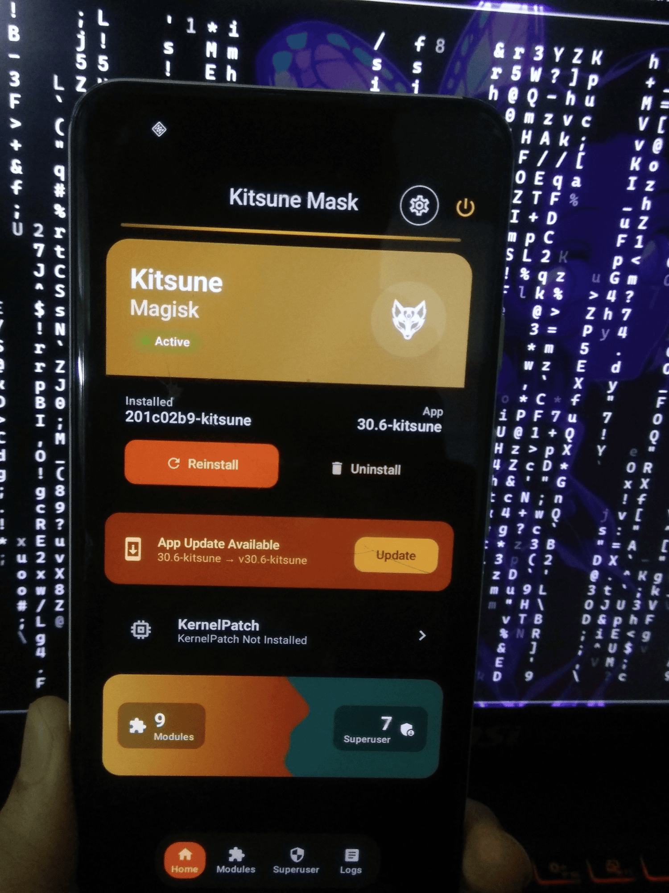

# Vedant P. Dubal

**DevOps · AI/ML Systems · Edge Inference**

> Hey, I'm Vedant — first-year B.Tech student.
> I spend my time breaking Linux installations, fixing them, and calling it learning. ¯\_(ツ)_/¯

I work on the layer between code and the metal it runs on — infrastructure automation, container orchestration, high-throughput model inference, and deploying C++/Rust runtimes at 2 AM while laptop fans scream at 8000 RPM.

Not a tutorial follower. I pick something, break it badly enough that I *have* to understand it to fix it, then write about what actually happened — not the clean version.

---

## What I Actually Work On

```
infrastructure automation  →  edge AI & native runtimes (C++/Rust)  →  keep systems alive
```

```bash
$ whoami
devops + aiml systems | edge inference | homelab guy | occasionally breaks things on purpose

$ uptime
00:00:00
```

---

## Projects

### 1. [DockYard Evolution: Agent Arena](https://github.com/vedantdubal-141/DockYard-Evolution-Agent-Arena-Private.git)
> A gym-like RL/LLM arena where AI agents must debug broken DevOps & build cascades — and we actively lie to them. (•̀ᴗ•́)و
> **🏆 Selected for Phase 2 (Scaler × OpenEnv × PyTorch × Hugging Face Hackathon)**


Tired of AI agents claiming they can automate DevOps until they run into a real broken multi-stage build. Built an adversarial evaluation arena simulating cascading software debugging failures across Docker, Java/Spring, and Rust/WASM build graphs.

- **Order-dependent prerequisite gating:** Designed DAG reward structures. You can't brute-force point-farm; prerequisite fixes must pass in sequence before unlocking subsequent rewards.
- **"The Lie" scenario:** The compiler log intentionally injects a fake OpenSSL crypto hash error to test whether the model actually reads configuration files or just hallucinates from log text.
- **Hidden regression tests:** Grader punishes destructive "lazy rewrites" that solve a build error by silently nuking critical infrastructure like `EXPOSE 8080`.
- **The 35B MoE Breakthrough:** Benchmarked dense vs MoE architectures — watched Qwen 3.5 35B A3B Apex figure out multi-file dependency edits in 2 steps while running at a chill 70°C, saving the CPU from a 95°C thermal meltdown.

---

### 2. Arch Linux Homelab + Android Chroot
> Running Linux without a second computer. ¯\(°_o)/¯



Manually installed Arch Linux from scratch — partition tables, kernel selection (linux-zen for the latency wins), bootloader config, and a TUI display manager because ASCII art login screens are a valid life choice.

When I needed a second machine to experiment on and didn't have one, I rooted an Android phone with Magisk and set up a full chroot environment inside Termux. Real kernel interfaces, bind-mounted `/proc /sys /dev`, near-native performance — no proot overhead.

Also self-hosted: Nextcloud, Nginx with SSL, VLANs, reverse proxy.

---

### 3. RVC Voice Model Training
> 8 hours of continuous GPU training on Arch Linux. What could go wrong. (ಠ_ಠ)


Everything. Everything went wrong first.

Fought through Python 3.12 + PEP 668 restrictions, NVIDIA PyPI timeouts pulling 500MB+ CUDA packages, torch compatibility hell, and a mid-training power cut that killed the session at epoch 20.

Logs were still intact. Resumed from checkpoint. Finished at 200 epochs, 14,000 steps, RTX 4070 running at 7.7GB/8GB VRAM the whole time.

---

## Real-world Sysadmin Work

**Windows boot failure recovery** — bootrec, sfc, chkdsk all failed. Booted live Linux USB, ran SMART checks with `smartctl`, used `rsync` instead of `cp` for interruptible backup, clean UEFI reinstall, `diskpart` to fix NTFS partition letter. Worked. `(⌐■_■)`

**Git/SSH debugging during a hackathon** — teammate couldn't push. DNS tweaks, proxy checks, HTTP/1.1 forcing — all dead ends. Switched remote from HTTPS to SSH, generated ed25519 keypair, back online in 5 minutes.

---

## Writing

I document what I actually do on LinkedIn — not polished tutorials, just what broke and what fixed it.

- Linux boot process (UEFI → initramfs → systemd)
- Manual Arch Linux install walkthrough
- Running Linux chroot on Android without a second machine
- RVC voice model training on Linux (parts 1 & 2)
- Windows boot failure diagnosis and full recovery
- Git/SSH debugging under hackathon pressure

---

## Currently Exploring

- Kubernetes cluster management at scale
- Infrastructure as Code (Terraform / Ansible)
- SRE practices and incident response
- Linux kernel internals — going deeper `(。・_・。)`

---

## Find Me

[](https://www.linkedin.com/in/vedant-p-dubal-2107733a4)
[](https://github.com/vedantdubal-141)
<!-- [](https://youtube.com/) -->
<!-- [](https://x.com/) -->

---

## 📊 GitHub Stats

<p align="center">
  
</p>

<p align="center">
  
</p>

<div align="center">
  <p><b>⭐ If you like my work, consider giving a star to my repositories!</b></p>
  <a href="https://github.com/vedantdubal-141?tab=repositories">
    
  </a>
</div>

---

## 🐍 Contribution Snake Graph

<picture>
  <source media="(prefers-color-scheme: dark)" srcset="https://raw.githubusercontent.com/vedantdubal-141/vedantdubal-141/output/github-snake-dark.svg" />
  <source media="(prefers-color-scheme: light)" srcset="https://raw.githubusercontent.com/vedantdubal-141/vedantdubal-141/output/github-snake.svg" />
  
</picture>

---

<sub>last updated when I should have been sleeping (~˘▾˘)~</sub>
