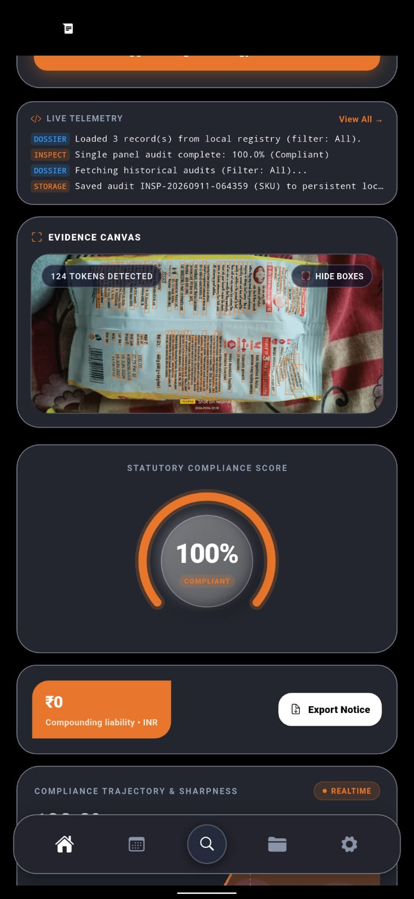
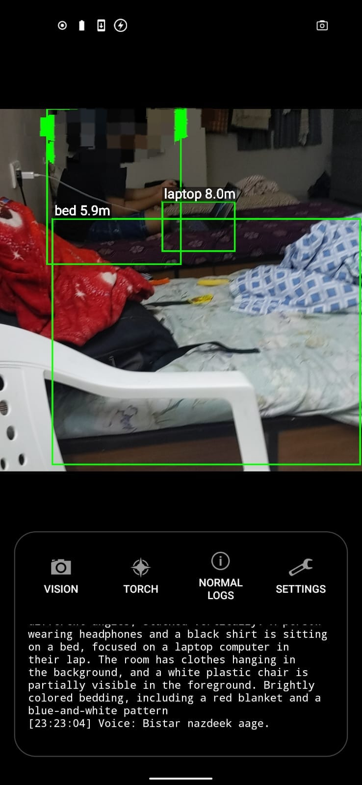
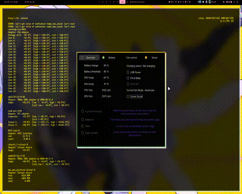

# Vedant P. Dubal

**DevOps · AI/ML Systems · Edge Inference**

> Hey, I'm Vedant — first-year B.Tech student.
> I spend my time breaking Linux installations, fixing them, and calling it learning. ¯\_(ツ)_/¯

I work on the layer between code and the metal it runs on — infrastructure automation, container orchestration, high-throughput model inference, and deploying C++/Rust runtimes at 2 AM while laptop fans scream at 8000 RPM.

Not a tutorial follower. I pick something, break it badly enough that I *have* to understand it to fix it, then write about what actually happened — not the clean version.

---

## What I Actually Work On

```
infrastructure automation  →  edge AI & native runtimes (C++/Rust)  →  keep systems alive
```

```bash
$ whoami
devops + aiml systems | edge inference | homelab guy | occasionally breaks things on purpose

$ uptime
00:00:00
```

---

## Projects

### 1. [DockYard Evolution: Agent Arena](https://github.com/vedantdubal-141/DockYard-Evolution-Agent-Arena-Private.git)
> A gym-like RL/LLM arena where AI agents must debug broken DevOps & build cascades — and we actively lie to them. (•̀ᴗ•́)و
> **🏆 Selected for Phase 2 (Scaler × OpenEnv × PyTorch × Hugging Face Hackathon)**


Tired of AI agents claiming they can automate DevOps until they run into a real broken multi-stage build. Built an adversarial evaluation arena simulating cascading software debugging failures across Docker, Java/Spring, and Rust/WASM build graphs.

- **Order-dependent prerequisite gating:** Designed DAG reward structures. You can't brute-force point-farm; prerequisite fixes must pass in sequence before unlocking subsequent rewards.
- **"The Lie" scenario:** The compiler log intentionally injects a fake OpenSSL crypto hash error to test whether the model actually reads configuration files or just hallucinates from log text.
- **Hidden regression tests:** Grader punishes destructive "lazy rewrites" that solve a build error by silently nuking critical infrastructure like `EXPOSE 8080`.
- **The 35B MoE Breakthrough:** Benchmarked dense vs MoE architectures — watched Qwen 3.5 35B A3B Apex figure out multi-file dependency edits in 2 steps while running at a chill 70°C, saving the CPU from a 95°C thermal meltdown.

---

### 2. [Themis: Statutory Metrology Vision Engine](https://github.com/vedantdubal-141/Themis/)
> Auditing Indian packaging compliance at 150ms per label with zero VRAM. 
> **🏆 Selected for SIH 2026 Phase 2 (Major Backend Contributor)**



Govt compliance audits are usually slow, painful, and manual. For Smart India Hackathon (SIH 2026), I served as the **major backend contributor**, engineering the high-throughput native Rust engine that verifies legal metrology (LMPC Rules 2011) and computes statutory Jan Vishwas compounding penalties directly off packaging photos.

- **100% Native Rust Backend:** Deep text detection (DBNet, 2.4MB) and sequence recognition (PP-OCRv4, 7.4MB) executed via ONNX Runtime on CPU/ARM — clocking **140–160ms latency per image using 0 MB VRAM**.
- **Line-Quantized Total-Order Sorting:** Real packaging is warped, cylindrical, and curved; naive bbox sorters crash from non-transitive comparisons. Engineered a line-quantized total-order sorter guaranteeing strict mathematical transitivity ($A \le B \land B \le C \implies A \le C$) on distorted labels.
- **Multi-Panel SKU Graph:** Aggregates tokens across front, back, and crimp panels into a single entity to audit mandatory declarations (MRP, Net Quantity, Mfg Date, Postal PIN).
- **Tokio Concurrency Profiles:** Configured dynamic worker profiles (e.g. 5/6 cores = 23 threads saturated) chewing through batch directories without freezing the OS or starving HTTP I/O.
- **Flutter Multi-Modal GUI:** Paired the native Rust daemon with a sleek Flutter desktop/mobile interface with a 120Hz canvas zoom and interactive bounding-box evidence overlays.

---

### 3. [AI Navigation Assistant (Mobile C++ Engine)](https://github.com/Souvik6222/AI_Navigation_Assistant)
> Squeezing a 2GB Python PyTorch pipeline into a lean 10MB C++ ARM binary for real-time edge navigation (⌐■_■)



Built in collaboration with [@Souvik6222](https://github.com/Souvik6222/). Souvik developed the original Python prototype using PyTorch, YOLOv8, and MiDaS to assist visually impaired individuals with distance and directional voice guidance.

Then came the edge problem: running PyTorch + TorchHub on low-power mobile hardware turns phones into pocket heaters and drains batteries in minutes. I converted the entire pipeline into **Modern C++17** and ported it to **Android ARM64** using **ONNX Runtime**:

- **Stripped the 2GB PyTorch Runtime:** Rewrote the inference and vision pipeline into native C++17 with ONNX Runtime C++ and OpenCV, shrinking the runtime down to a standalone **~10MB native binary** for ARM64 and Android.
- **Dual-Model Edge Vision:** Pipelined real-time YOLOv8 object detection with MiDaS monocular depth estimation and directional zone classification (Left / Center / Right).
- **Greedy Tracking Engine:** Replaced heavy SciPy Hungarian matching with an efficient C++ greedy IoU tracker, velocity vectors, and multi-frame temporal confirmation to eliminate false-alarm spam.
- **Android NDK & JNI Bridge:** Wired the native C++ engine into an Android APK via JNI for hardware camera capture and asynchronous text-to-speech audio alerts.

---

### 4. RVC Voice Model Training
> 8 hours of continuous GPU training on Arch Linux. What could go wrong. (ಠ_ಠ)



Everything. Everything went wrong first.

Fought through Python 3.12 + PEP 668 restrictions, NVIDIA PyPI timeouts pulling 500MB+ CUDA packages, torch compatibility hell, and a mid-training power cut that killed the session at epoch 20.

Logs were still intact. Resumed from checkpoint. Finished at 200 epochs, 14,000 steps, RTX 4070 running at 7.7GB/8GB VRAM the whole time.

---

## Open Source *(When Things Break)*

I don't actively hunt open source contributions — but when tools crash in my terminal or catalogs lag behind, I dig into the tracebacks:

- **(OPENCODE, Major one) [models.dev#3761](https://github.com/anomalyco/models.dev/pull/3761)** — Updated the Groq provider catalog for `models.dev` adding Qwen 3.6 27B and ALLaM 2 7B specifications verified directly from upstream Groq API endpoints.
- **[harlequin#982](https://github.com/tconbeer/harlequin/issues/982)** — Isolated and reproduced an unhandled crash in Harlequin (Terminal SQL IDE) where executing `USE <database>;` in MySQL/MariaDB passed a trailing semicolon into reconnect routines (`Unknown database 'db;'`). Maintainer reproduced and released the fix in `harlequin-mysql v1.3.1`.


---

## Real-world Sysadmin Work

**Windows boot failure recovery** — bootrec, sfc, chkdsk all failed. Booted live Linux USB, ran SMART checks with `smartctl`, used `rsync` instead of `cp` for interruptible backup, clean UEFI reinstall, `diskpart` to fix NTFS partition letter. Worked. `(⌐■_■)`

**Git/SSH debugging during a hackathon** — teammate couldn't push. DNS tweaks, proxy checks, HTTP/1.1 forcing — all dead ends. Switched remote from HTTPS to SSH, generated ed25519 keypair, back online in 5 minutes.

---

## Writing

I document what I actually do on LinkedIn — not polished tutorials, just what broke and what fixed it.

- Linux boot process (UEFI → initramfs → systemd)
- Manual Arch Linux install walkthrough
- AI agent arenas: testing LLM debugging capabilities under adversarial build environments
- Building high-throughput vision pipelines in Rust with ONNX Runtime
- Porting PyTorch deep learning models to C++ and Android ARM64
- RVC voice model training on Linux (parts 1 & 2)
- Windows boot failure diagnosis and full recovery
- Git/SSH debugging under hackathon pressure

---

## Currently Exploring

- Kubernetes cluster management at scale
- Infrastructure as Code (Terraform / Ansible)
- SRE practices and incident response
- Linux kernel internals — going deeper `(。・_・。)`

---

## Find Me

[](https://www.linkedin.com/in/vedant-p-dubal-2107733a4)
[](https://github.com/vedantdubal-141)
<!-- [](https://youtube.com/) -->
<!-- [](https://x.com/) -->

---

## 📊 GitHub Stats

<p align="center">
  
</p>

<p align="center">
  
</p>

<div align="center">
  <p><b>⭐ If you like my work, consider giving a star to my repositories!</b></p>
  <a href="https://github.com/vedantdubal-141?tab=repositories">
    
  </a>
</div>

---

## 🐍 Contribution Snake Graph

<picture>
  <source media="(prefers-color-scheme: dark)" srcset="https://raw.githubusercontent.com/vedantdubal-141/vedantdubal-141/output/github-snake-dark.svg" />
  <source media="(prefers-color-scheme: light)" srcset="https://raw.githubusercontent.com/vedantdubal-141/vedantdubal-141/output/github-snake.svg" />
  
</picture>

---

<sub>last updated when I should have been sleeping (~˘▾˘)~</sub>
